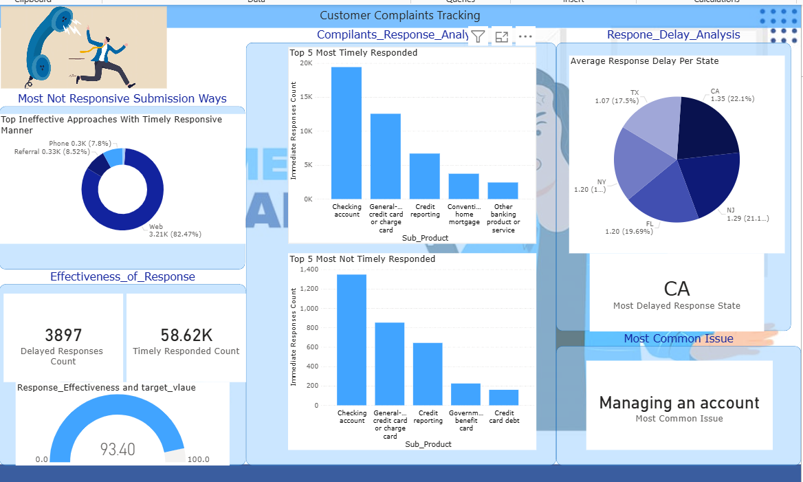

# 📊 Response Effectiveness Power BI Dashboard  

## 📌 Project Overview  
This project contains a **Power BI dashboard** designed to analyze **customer complaint responses** and measure **response effectiveness**.  

The report highlights:  
- Percentage of timely vs delayed responses.  
- Product categories with the best and worst response times.  
- State-level response delays.  
- The most common complaint issues and submission channels.  

---

## 🗂 File Structure  
- `Customer_Compliants_Tracking_Report.pbix` → Power BI report file containing the dashboard and DAX measures.  
- `Compliants_Analysis.PNG` → Screenshot preview of the dashboard.  

---

## ⚙️ Key DAX Measures  
```DAX
-- Count of Yes Responses
Yes_Count =
CALCULATE (
    COUNTROWS ( Data ),
    Data[Timely response?] = "Yes"
)

-- Response Effectiveness (Percentage of Yes)
Response_Effectiveness =
ROUND (
    DIVIDE (
        CALCULATE ( COUNTROWS ( Data ), Data[Timely response?] = "Yes" ),
        COUNTROWS ( Data ),
        0
    ) * 100,
    2
)
```  

---

## 📸 Dashboard Preview  
  

---

## 🔎 Key Insights  

### 🔹 Response Effectiveness  
- **Timely responses**: **58.62K**  
- **Delayed responses**: **3,897**  
- **Overall effectiveness**: **93.40%** timely response rate (excellent performance).  

### 🔹 Most Common Issue  
- **Managing an account** is the most frequent customer complaint.  

### 🔹 Top Submission Channels  
- **Web** → 82.47% of timely responses (most effective).  
- **Referral** → 8.52%.  
- **Phone** → 7.8% (least effective).  

### 🔹 Most Timely Responded Products  
1. Checking account  
2. General-purpose credit card or charge card  
3. Credit reporting  
4. Conventional home mortgage  
5. Other banking products or services  

### 🔹 Least Timely Responded Products  
1. Checking account (appears in both lists → inconsistent service quality).  
2. General-purpose credit card or charge card  
3. Credit reporting  
4. Government benefit card  
5. Credit card debt  

### 🔹 Response Delay by State  
- **California (CA)** → Most delayed (22.1%, avg delay 1.35 days).  
- **New Jersey (NJ)** → 21.1%, avg delay 1.29 days.  
- **Florida (FL)** → 19.7%, avg delay 1.20 days.  
- **New York (NY)** → 19.6%, avg delay 1.20 days.  
- **Texas (TX)** → 17.5%, avg delay 1.07 days (best performer).  

---

## 📈 Overall Conclusion  
The dashboard shows that the organization is performing strongly with **over 93% timely responses**. However:  
- Certain **states (CA, NJ, FL)** consistently show slower responses.  
- **Checking account complaints** appear in both the best and worst response lists, indicating inconsistent service.  
- **Phone and referral submissions** need improvement compared to web-based complaints.  

Improving response consistency in these areas will further enhance customer satisfaction.  

---

## 🔧 Requirements  
- **Power BI Desktop** (latest version recommended).  
- Original dataset (not included here — replace with your own if necessary).  

---

## 📄 License  
This project is released under the [MIT License](LICENSE).  
